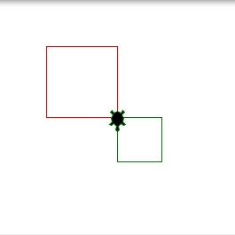
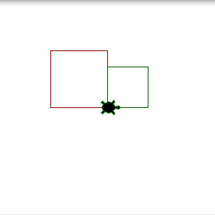
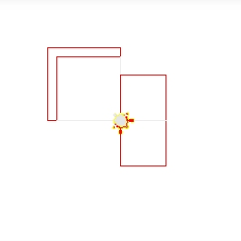

<h1 style="margin-bottom: 10pt;">Automatic Assessment for Visual Computing in browser based programming</h2>

    

        
        
<a href="https://github.com/dev-clemon">dev-clemon</a>

    

    <!-- 

        
        
<a href="https://twitter.com/PatrickKidger">@PatrickKidger</a>

    
 -->

--split--

## 1. Introduction

Visual programming is often used in introductory programming courses because it provides direct feedback to users. However, there are some drawbacks, particularly in the area of autograding. Unlike text output, visual output can be more challenging to evaluate. While professional testing tools often rely on screenshot comparison, this method may not be suitable for computer science education. In recent years, we have developed **WebTigerPython**, a web-based IDE frequently used in schools in German-speaking regions, and we are planning to integrate automated testing for the platform, helping teachers giving instant feedback to students and making courses more scalable.

## 2. Background

**WebTigerPython** is a browser-based Python IDE designed for computer science education. It supports a plethora of features, including:

- **Zero-Installation**: Runs directly in any modern web browser. No login required.
- **Universal Access**: Compatible with any device (laptops, tablets, Chromebooks).
- **Powerful Libraries**: Built-in support for Turtle Graphics, robotics and more
- **Beginner-Friendly**: Features an interactive debugger and simplified syntax to lower the barrier to entry.
- **High Ceiling**: Supports advanced libraries like Pygame, NumPy, and SciPy.

According to surveys among teachers, the platform is used in schools by students aged 12 - 17. Main reasons why teachers use the plattform is the light weighness, easy integratability and the minimalistic design. We do have about 1000 unique users on our platform.

## 3. Automated Assessment

Creating and grading programming assignments, especially those with visual components, can be time-consuming for educators. 

- **Traditional unit tests** are often insufficient for evaluating visual output.
- **Defining test cases** requires deep knowledge and can limit the structure of the code.

One common solution is to use screenshot comparison and heatmaps, which highlight areas where the student's solution differs from the intended outcome.

--split--

    

        
        
<strong>Expected Shapes</strong>

    

    

        
        
<strong>Actual Shapes</strong>

    

    

        
        
<strong>Difference</strong>

    

In the example with the heatmap, the visual outputs indicate that the student correctly set up two squares; however, the relative positioning and size of one square are incorrect. While developers may easily interpret these images, they may not be as intuitive for students. Additionally, requiring pixel-perfect solutions is not always desirable, as it can limit students' creative freedom in problem-solving.

## 4. Our Approach: AST & Visual Dump

In our approach, we aim to move away from traditional test cases and instead focus on exporting the objects rendered on the canvas for analysis. This allows us to evaluate the rendered objects, their relative positioning, and their connectedness. Additionally learning about the usage of control structures like loops, conditioan is an integral part in copmuter science eductation. This is someting that could be controlled by analyzing the abstact syntax tree (AST).

Based on this information, a fine grained feedback can be provided. Where we can focus on the already correct parts of the exercise and provide feedback. E.g. in the example with the two squares it could be: 

!!! warning "4/6 Test cases passed"
    - **Shape number**: 2/2
    2 squares were expected, you drew two squares, well done!
    - **Shape connectedness**: 1/1
    The two shapes are connected, well done!
    - **Function**: 1/1
    You used a function to draw the square, well done!
    - **Loop**: 1/1
    You used a loop to draw the shapes, well done!
    - **Shape size**: 1/2
    The size of one shape is incorrect.
    - **Shape orientation**: 1/2
    The orientation of 1 shape is incorrect

We plan to do the test generation automatically

## 5. Current State / Future Work

Right now we are still in an early stage of defining the test cases. Next steps will be talking to educators and refining our requirements for what will be exactly tested, additionally we have to specify how we want to measure the effectivity of our approach. The next steps will be a first implementation and a pilot study with students.