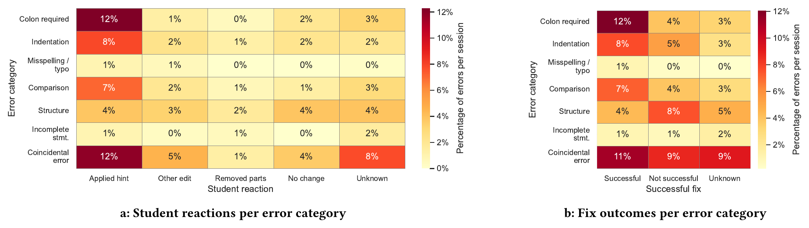

---
# try also 'default' to start simple
theme: bricks
# random image from a curated Unsplash collection by Anthony
# like them? see https://unsplash.com/collections/94734566/slidev
background: https://source.unsplash.com/collection/94734566/1920x1080
# apply any windi css classes to the current slide
class: 'text-center'
# https://sli.dev/custom/highlighters.html
highlighter: shiki
# show line numbers in code blocks
lineNumbers: false
# persist drawings in exports and build
drawings:
  persist: false
# use UnoCSS (experimental)
wakeLock: "build"
# aspect ratio for the slides
aspectRatio: 16/9
css: unocss
---

# Python Errors in `if` Conditionals

## Novices' Reactions to Error Messages

Clemens Bachmann - Angélica Herrera Loyo - Tobias Kohn - Dennis Komm

UKICER 2026 - Cambridge, UK

---
layout: wtp-2-cols
code: |
  result = True

  if result:
      print("result is true")
  else == not(result):
      print("result is not true")
---

# A Familiar Struggle?

<v-clicks>

- A real student wrote this
- "colon required" — tried again, same message
- 12 attempts later... still stuck
- Even the *right* hint didn't help

</v-clicks>

---

# Why This Matters

<v-clicks>

- Learning to program is hard
- Error messages: heavily studied — **in Java**
- Python's syntax differs, understanding lags behind
- Is it just wording — or something deeper?

</v-clicks>

---

# Research Questions

<v-clicks>

- **RQ1** — What errors occur around `if` statements?
- **RQ2** — Are the error messages actionable?
- **RQ3** — Do students actually fix their code?

</v-clicks>

---
layout: wtp-2-cols
code: |
  from turtle import *

  colors = ["red", 
            "blue", 
            "yellow", 
            "green"]

  for c in colors:
      for i in range(4):
          pencolor(c)
          forward(100)
          left(90)
      left(90)
---

# Meet WebTigerPython

<v-clicks>

- Free, browser-based Python IDE — no install
- Built for learners aged 12–18
- TigerPython parser: fine-grained, localised errors
- Every error, opt-in, became our dataset

</v-clicks>

---

# The Data

<v-clicks>

- WebTigerPython + TigerPython parser
- **761,886** error messages
- 93,037 sessions - 35,832 users
- 9 months, opt-in, anonymised

</v-clicks>

---

# From 761k to 567

<v-clicks>

- Filtered: sessions of 10–60 minutes
- 200 sessions containing conditionals
- Hand-checked by the authors
- → **567 error events**, 120 sessions

</v-clicks>

---

# Coding Every Error, Four Ways

<v-clicks>

- **Category** — what went wrong 
- **Message quality** — what type of feedback was provided
- **Reaction** — what did the student do
- **Fix** — did it work

</v-clicks>

4 authors - majority rule - Krippendorff's α for inter-rater agreement

---

RQ1

# What Errors Occur Around `if` Statements?

<table class="w-full text-lg mt-2">
<thead>
<tr class="text-left opacity-50 text-sm">
<th class="pb-1 font-normal">Error category</th>
<th class="pb-1 font-normal">Example</th>
<th class="pb-1 font-normal text-right"></th>
</tr>
</thead>
<tbody>

<tr v-click><td class="py-1">Coincidental (unrelated)</td><td class="font-mono text-sm opacity-70">if Maht.sqrt(x) &lt; 1/x:</td><td class="text-right font-bold">29%</td></tr>
<tr v-click><td class="py-1">Colon required</td><td class="font-mono text-sm opacity-70">if (my_list[index] % 2 == 0)</td><td class="text-right font-bold">19%</td></tr>
<tr v-click><td class="py-1">Structure</td><td class="font-mono text-sm opacity-70">elif: x == "example":</td><td class="text-right font-bold">17%</td></tr>
<tr v-click><td class="py-1">Indentation</td><td class="font-mono text-sm opacity-70">&nbsp;&nbsp;&nbsp;&nbsp;if i &lt; 0:</td><td class="text-right font-bold">16%</td></tr>
<tr v-click><td class="py-1">Comparison</td><td class="font-mono text-sm opacity-70">elif s >= 16 and &lt;= 26:</td><td class="text-right font-bold">14%</td></tr>
<tr v-click><td class="py-1">Incomplete statement</td><td class="font-mono text-sm opacity-70">if note ==</td><td class="text-right font-bold">3%</td></tr>
<tr v-click><td class="py-1">Misspelling / typo</td><td class="font-mono text-sm opacity-70">if input_num == 22.</td><td class="text-right font-bold">2%</td></tr>

</tbody>
</table>

---

RQ2

# Are the Error Messages Actionable?

<v-clicks>

- Actionable — **38%**
- Specific hint — **61%**
- Unspecific descr. — **1%**

</v-clicks>

Mostly good... on paper (α = 0.38 — raters often disagreed here)

---

RQ3

# Do Students Actually Fix Their Code?

<v-clicks>

- **45%** — fixed
- **31%** — not fixed
- **25%** — unknown (session ended)

</v-clicks>

Roughly half — the rest we can't take for granted

---

# ...But It Depends on the Error

Colon errors get fixed. Structure errors stay broken.

reaction α = 0.67 · fix α = 0.79

---

# The "else" Saga, Continued

<table class="w-full text-xl font-mono mt-8">
<thead>
<tr class="text-left opacity-50 text-base">
<th class="pb-3 font-normal">Code</th>
<th class="pb-3 font-normal">Message</th>
</tr>
</thead>
<tbody>

<tr v-click><td class="py-2 pr-10">else == not(result):</td><td class="opacity-80">colon required</td></tr>
<tr v-click><td class="py-2 pr-10">else: == not(result):</td><td class="opacity-80">'==' seems to be superfluous</td></tr>
<tr v-click><td class="py-2 pr-10">else not(result):</td><td class="text-yellow-400 font-bold">else never has a condition</td></tr>
<tr v-click><td class="py-2 pr-10">else (result):</td><td class="text-yellow-400 font-bold">else never has a condition</td></tr>
<tr v-click><td class="py-2 pr-10">else == result:</td><td class="opacity-80">colon required</td></tr>

</tbody>
</table>

<v-click>

The right hint appears twice. The student never acts on it — and ends up back where they started.

</v-click>

---

# Our Hypothesis

<v-clicks>

- Correct ≠ helpful
- A hint only works if it matches the student's mental model
- Colon errors: fix matches expectation → resolved
- Structure errors: fix clashes with a misconception → stuck

</v-clicks>

---

# Limitations

<v-clicks>

- Error events only — no successful runs recorded
- Small qualitative sample
- Unknown demographics
- Moderate rater agreement on message quality

</v-clicks>

---

# Takeaways

<v-clicks>

- Errors related to structure are common — and hard to fix
- "Good" error messages aren't always enough
- Feedback needs to meet students where they are
- Next: guidance beyond the message itself

</v-clicks>

---
class: 'text-center'
---

# Thank You

### Questions?

Clemens Bachmann - clemens.bachmann@inf.ethz.ch

