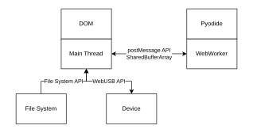
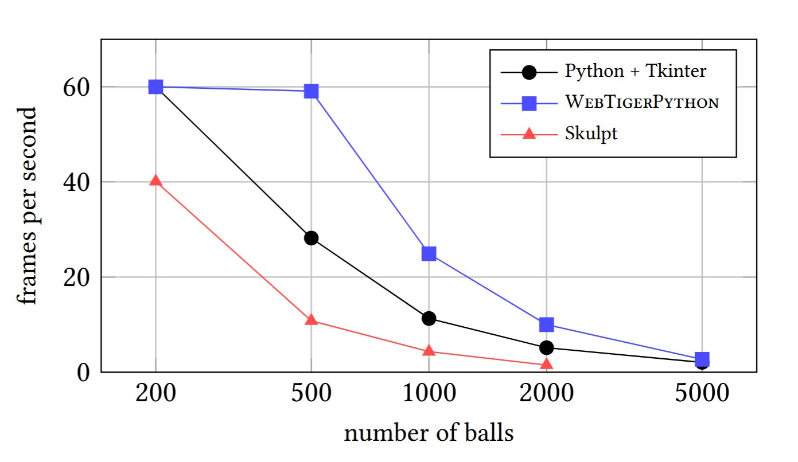

---
# try also 'default' to start simple
theme: bricks
# random image from a curated Unsplash collection by Anthony
# like them? see https://unsplash.com/collections/94734566/slidev
background: https://source.unsplash.com/collection/94734566/1920x1080
# apply any windi css classes to the current slide
class: 'text-center'
# https://sli.dev/custom/highlighters.html
highlighter: shiki
# show line numbers in code blocks
lineNumbers: false
# persist drawings in exports and build
drawings:
  persist: true
# use UnoCSS (experimental)
wakeLock: "build"
# aspect ratio for the slides
aspectRatio: 16/9
css: unocss
canvasWidth: 900
---

# WebTigerPython

## A Low-Floor High-Ceiling Python IDE for the Browser
## SIGCSE 2026

Clemens Bachmann

---
layout: two-cols-header
---

# Who am I

::left::
- Name: Clemens Bachmann
- Occupation: Doctoral Student
- Email: clemens.bachmann@inf.ethz.ch
- University: ETH Zürich (Switzerland)

::right::

[Illustration by Anna Staub](https://www.instagram.com/anna.staub.illustration/?hl=en)

---
zoom: 1.2
---

# Authors of this Paper

- Clemens Bachmann Doctoral Student ETH Zürich (CH)
- Alexandra Maximova Doctoral Student ETH Zürich (CH)
- Dennis Komm Professor ETH Zürich (CH)
- Tobias Kohn Professor KIT (DE)

---
layout: two-cols-header 
---

# Educational IDE - Requirements

::left::

- Simple
- Fast
- Works on any device
- Robotics
- Visual Output

::right::

<v-click at="2">

| High Ceiling |  |
|----|----|
|  |  |

</v-click>

<v-click at="1">

| Low Floor |  |
|----|----|
|  |  |

</v-click>

---
layout: two-cols-header 
zoom: 1.2
---

# Implementation WebTigerPython

::left::

- Works on any device -> Web Based
- Web Worker to execute code
- Web APIs for robotics / files

::right::

 </img>

---
layout: wtp-2-cols
code: |
  from gturtle import *
  makeTurtle()

  for color in ["red", 
                "blue", 
                "darkgreen", 
                "orange"]:
      setPenColor(color)
      repeat 4:
          forward(100)
          right(90)
      right(90)
---
# Low Floor 1 - Turtle

- Reimplementation from scratch
  - TKinter does not work in the browser
- PixiJS

---
layout: wtp-2-cols
code: |
  from mbrobot_plusV3 import *

  forward()
  repeat:
      d = getDistance()
      print(d)    
      if d < 20:
          stop()    
      delay(200)
---
# Low Floor 2 - Physical Computing

- WebUSB
  - Only in Chrome
- Simulation

---
layout: wtp-2-cols
code: |
  import numpy as np
  import matplotlib.pyplot as plt

  x = np.arange(0, 10.01, 0.01)
  f1 = np.sin(x)
  f2 = np.cos(x)
  f3 = 0.01 * x**2 + 0.15 * x - 1

  plt.plot(x, f1, color="red")
  plt.plot(x, f2, color="blue")
  plt.plot(x, f3, color="green")

  plt.show()
---
# High Ceiling 1 - Scientific Python

- Numpy / Scipy / Matplotlib
  - Thanks to Pyodide
- Use agg (Anti-Grain Geometry) to render
- Limitation: no direct access to the DOM
  - No events
  - No animations

---
layout: wtp-2-cols
code: |
  from gturtle import *
  from time import *
  from random import randrange

  breite = Screen().window_width()
  hoehe = Screen().window_height()
  fps = 10
  farbeSchlange = "green"
  farbeEssen = "red"

  spc("white")
  dot(1000)

  def createFood():
      pos = getPos()
      done = False
      spc(farbeEssen)
      while not done:
          x = randrange(-breite//20*10,breite//20*10,10)
          y = randrange(-hoehe//20*10,hoehe//20*10,10)
          setPos(x,y)
          color = getPixelColorStr()
          if color == "white":
              dot(8)
              setPos(pos)
              spc(farbeSchlange)
              done = True

  def richtungsWechsel(x):
      if x == "a":
          setHeading(-90)
      elif x == "d":
          setHeading(90)
      elif x == "w":
          setHeading(0)
      elif x == "s":
          setHeading(180)

  def teleport():
      x = getX()
      if x > breite/2 or x < -breite/2:
          setX(-x)
      y = getY()
      if y > hoehe/2 or y < -hoehe/2:
          setY(-y)

  def putzen():
      pos.append(getPos())
      if len(pos) > laenge:
          setPos(pos[0])
          spc("white")
          dot(15)
          setPos(pos[-1])
          del pos[0]
          spc(farbeSchlange)

  spw(8)
  spc(farbeSchlange)
  ht()
  createFood()
  points = 0
  name = input("Wie heisst du?")
  pause = False

  laenge = 5
  pos = []

  repeat:
      x = getKey()
      richtungsWechsel(x)

      if x == "p":
          pause = True

      while pause:
          delay(50)
          if getKey() == "p":
              pause = False

      putzen()
      
      penUp()
      forward(10)
      color = getPixelColorStr()
      back(10)
      if color == farbeSchlange :
          pd()
          forward(5)
          break
      elif color == "red":
          createFood()
          points += 1
          fps *= 1
          laenge += 3
      penDown()

      # Bewegen
      forward(10)
      delay(1000/fps)

      # Falls es unten rausfaellt oben wieder rein
      teleport()

  print(name, "you scored", points, "points")
  if points > 10:
      print("WON")
  else:
      print("LOST")
---
# High Ceiling 1 - Interactive Programming

- Input
- Inputisteners
  - Keyboard
  - Mouse

---
layout: wtp-2-cols
code: |
  import numpy as np
  import matplotlib.pyplot as plt

  x = np.arange(0, 10.01, 0.01)
  f1 = np.sin (x)
  f2 = np. cos (x)
  f3 = 0.01 * x**2 + 0.15 * x - 1

  plt.plot(x, f1, color="red")
  plt.plot(x, f2, color="blue")
  plt.plot(x, f3, color="green")

  plt. show()
---
# High Ceiling 2 - Scientific Python

- Numpy / Scipy / Matplotlib
- Use agg to render within python
- Limitation
  - No events
  - No animations

---
zoom: 0.9
---
# Evaluation 1 - Compuing Benchmark

## Mandelbrot Set Computation
**Test Case:** 200×200 pixel image with 4,000,000 iterations of z′ = z² + c

| Platform | Execution Time | Performance vs CPython |
|----------|---|---|
| **Native Python** | 0.16 s | Baseline |
| **WebTigerPython** | 0.38 s | ~2.4× slower |
| **PyodideU** | 118 s | ~738× slower |
| **trinket.io** (Skulpt) | 43 s | ~269× slower |

---
layout: two-cols 
---
# Evaluation 2 - Graphics Benchmark

- 1000 Balls
- WebTigerPython looks smoother
- CPython is outperformed

</img>

::right::
  

  <SlidevVideo v-click="1" autoplay controls width="220px">
    <source src="./images/pythonballs.mp4" type="video/mp4" />
  </SlidevVideo>
  
Native Python

  <SlidevVideo v-click="1" autoplay controls width="220px">
    <source src="./images/wtpballs.mp4" type="video/mp4" />
  </SlidevVideo>
  
WebTigerPython

---

# Evaluation 3 - Teacher Survey

- Userbase 12 years and above
  - Most Users 15 - 17 years
- URL Sharing was liked
- Easy integratable into other tools
- Simple

---

# More to explore!

- Debugger
- Robotics Simulator
- Pygame integration
- Music

---

# Future Work

- Multifile
- Robots over WiFi
...

---
layout: wtp-2-cols
code: |
  from
---
# WebTigerPython

- Educational IDE
- Low Floor
  - Turtle
  - Robotics
- High Ceiling
  - Interactive Programming
  - Scienctific Progamming
- Benchmarks
  - 2-3 Times slower than Native Python
  - Graphics Rendering can be faster