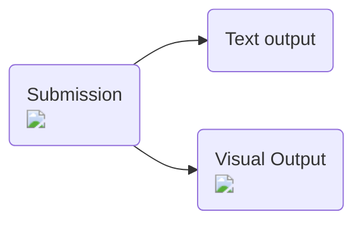
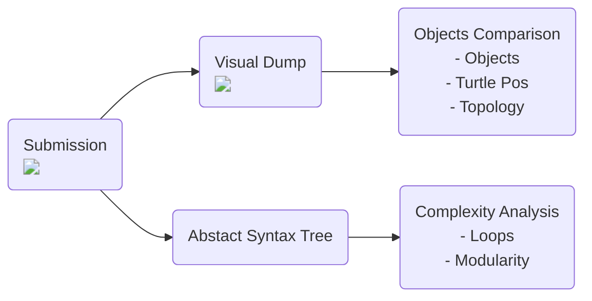
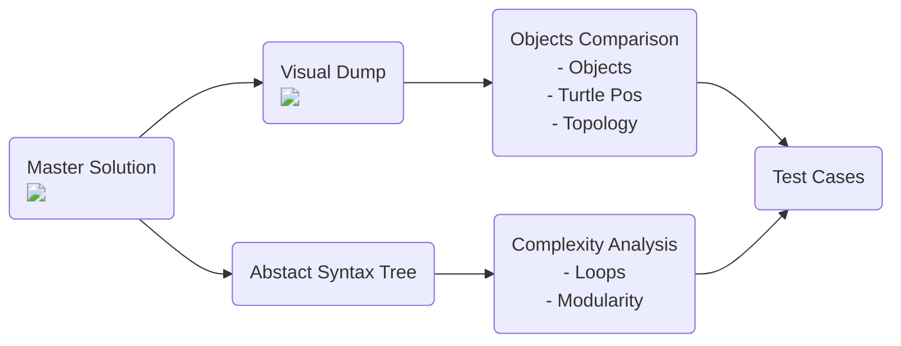

---
# try also 'default' to start simple
theme: default
# random image from a curated Unsplash collection by Anthony
# like them? see https://unsplash.com/collections/94734566/slidev
# background: https://source.unsplash.com/collection/94734566/1920x1080
# apply any windi css classes to the current slide
class: 'text-center'
# https://sli.dev/custom/highlighters.html
highlighter: shiki
# show line numbers in code blocks
lineNumbers: false
# persist drawings in exports and build
drawings:
  persist: false
# use UnoCSS (experimental)
wakeLock: "build"
# aspect ratio for the slides
aspectRatio: 16/9
css: unocss
---

# WebTigerPython

## Automatic assessment for visual computing

Clemens Bachmann

---
layout: two-cols-header
---

# Who am I

::left::
- Clemens Bachmann
- Doctoral Student
- clemens.bachmann@inf.ethz.ch
- Algorithms and **Didactics** Group
- Working in the Group of Dennis Komm
- Teaching Experience

::right::

[Illustration by Anna Staub](https://www.instagram.com/anna.staub.illustration/?hl=en)

---
layout: two-cols-header
---

# TigerJython 2012- (A bit of History)

::left::
- Jython
- Visual Computing
  - Turtle, Games
- Robotics
  - micro:bit
  - Mindstorms EV3
  - etc.
- Works on any Plattform (Windows, Mac, Linux)
- Easy installation
- Interactive Debugger
- Extended Syntax e.g.
  - repeat loop
  - autocasting of inputs

::right::

 

---
layout: wtp-2-cols
code: |
  from gturtle import *

  setFillColor("magenta")
  setPenColor("magenta")
  startPath()
  for i in range(5):
      fd(160)
      rt(144)
  fillPath()
---

# What is WebTigerPython

<v-clicks>

- IDE
- WebBased
  - No installation required
  - Works on any device
- For beginners
- Lots of libraries
  - Turtle

</v-clicks>

---
layout: wtp-2-cols
device: micro:bit
code: |
  from mbrobot import *
  from microbit import *

  setSpeed(100)
  repeat:
    v = irLeft.read_digital()
    if v == 0:
        rightArc(0.1)
    else: 
        leftArc(0.1)
    sleep(100)
wtpLayout: '[["Editor", "Canvas"]]'
---

# What is WebTigerPython

- IDE
- WebBased
  - No installation required
  - Works on any device
- For beginners
- Lots of libraries
  - Turtle
  - Robotics

---
layout: wtp-2-cols
code: |
  numbers = [3,7,12,56]
  total_sum = 0
  count = 0
  
  for number in numbers:
      total_sum += number
      count += 1

  print(total_sum / count)
wtpLayout: '[["Editor", "Console"]]'
---

# What is WebTigerPython

- IDE
- WebBased
  - No installation required
  - Works on any device
- For beginners
- Lots of libraries
  - Turtle
  - Robotics
  - Debugger

<v-clicks>

- More examples on [python-online.ch](https://python-online.ch)

</v-clicks>

---
layout: two-cols-header
---
# Some Numbers

::left::

- About 500 - 1000 daily users
- Used in Switzerland
  - Also Austria and Germany

- We collect error messages

::right::

  
---

# Teacher Feedback

- Ubiquitiy is appreciated
- Code sharing / iframe integration
- Simplicity

---
layout: two-cols-header
---

# Research Focus: Automated Assignments

::left::

- Defining Test Cases 
  - Needs deeper knowledge
  - Takes up time
  - Limits how you structure code
    - Define functions with specific names (extranous load)

- Limitations
  - Coverage
  - Tolerance

::right::

---

# Automated Assignments: Visual Computing

---

# Mastersolution to Testcase

---

# Further Thoughts

- Generalizibility
- Easy Integration
  - Test sharing with url
  - Run test with iframe
- Event handling testing?

---

# Related Research

VISGRADER: Automatic Grading of D3 Visualizations
  - Use Topology of DOMS

