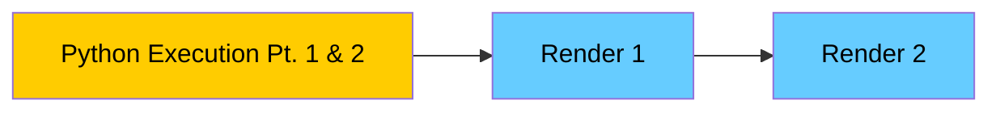
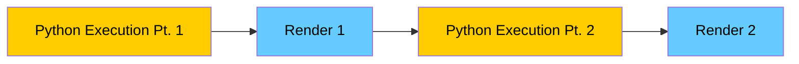

---
# try also 'default' to start simple
theme: bricks
# random image from a curated Unsplash collection by Anthony
# like them? see https://unsplash.com/collections/94734566/slidev
background: https://source.unsplash.com/collection/94734566/1920x1080
# apply any windi css classes to the current slide
class: 'text-center'
# https://sli.dev/custom/highlighters.html
highlighter: shiki
# show line numbers in code blocks
lineNumbers: false
# persist drawings in exports and build
drawings:
  persist: false
# use UnoCSS (experimental)
wakeLock: "build"
# aspect ratio for the slides
aspectRatio: 16/9
css: unocss
---

# WebTigerPython
##  Videospiel- und Robotikprogrammierung
### Informatiktage

Clemens Bachmann

---
layout: two-cols-header
---

# Who am I

::left::
- Clemens Bachmann
- Doctoral / Teachers Diploma Student
- clemens.bachmann@inf.ethz.ch
- Algorithms and **Didactics** Group
- Working in the Group of Dennis Komm

::right::


[Illustration by Anna Staub](https://www.instagram.com/anna.staub.illustration/?hl=en)

---
layout: wtp-2-cols
code: |
  # Koch.py

  from gturtle import *

  def koch(s, n):
      if n == 0:
          forward(s)
          return
      koch(s / 3, n - 1)
      left(45)
      koch(s / 3, n - 1)
      right(90)
      koch(s / 3, n - 1)
      left(45)
      koch(s / 3, n - 1)

  setPenColor("blue")
  speed(-1)
  setPos( -100, 100)
  for i in range(4):
      right(90)
      koch(100, 4)
---

# WebTigerPython🐯🐍 - Programming in the browser

### What is it?
- Web based IDE
- Focus Education
- Open Source

### Schedule for Today:
- New Features
- Hands-on Examples
- Future Features
---
layout: two-cols-header
---

# Libraries of WTP 🛠️

::left::


Visual Computing (turtle, gpanel, pygame)


playTone, JythonMusic


[python-online.ch/](https://python-online.ch/)

::right::


Databases (sqlite3, database1)


Robotics (WebUSB, simulation)

---
zoom: 0.7
---

# Usage of Python Libraries 
### (Total reports > 1 Mio)

| Concept              | Logged Error Messages Count    |
|----------------------|----------|
| **gturtle**          | **318,265** |
| **random**           | **89,811**  |
| **turtle**           | **54,784**  |
| **math**             | **14,357**  |
| **time**             | **12,630**  |
| **microbit**         | **10,661**  |
| **gpanel**           | **7,794**   |
| **gamegrid**         | **3,128**   |
| **music**            | **3,030**   |
| **matplotlib.pyplot** | **2,957**   |

---
layout: two-cols-header
---

# Overview of all libraries

::left::

- Computer Graphics
    - turtle
    - gpanel
    - matplotlib
    - pygame 🆕
    - gamegrid 🆕
    - Pillow 🆕
- Music
    - playTone in gturtle
    - JythonMusic (no drums) 🆕

::right::

- Database (inc Visualisation) 🆕
    - Database1 (Einfach Informatik)🆕
    - sqlite3 🆕
- Robotics
    - microbit
        - mbrobot (Maqueen)
        - mborobot_plusV2/V3 🆕 (Maqueen Plus)
    - calliopemini
        - callibot
        - calliope motion kit 2 🆕
    - Simulation for microbit / calliopemini 🆕
    - rootRobot (bluetooth) 🆕

---
layout: wtp-2-cols
code: |
    from PIL import Image

    size = (5, 5)
    img = Image.new('RGB', size)

    colors = [
        (255, 0, 0),
        (0, 255, 0)
    ]

    for y in range(size[1]):
        for x in range(size[0]):
            img.putpixel((x, y), colors[(x + y) % 2])

    img.show()

    print(f"Image size: {img.size}")
    print(f"Image mode: {img.mode}")
    print(f"Pixels: {list(img.getdata())}")
leftWidth: 30%
---
# Pillow Example

- Python imaging library
- Multifile 😉
---
layout: wtp-2-cols
code: |
  import pygame

  pygame.examples.chimp.main()
---


- Popular library for programming games
- Sounds, images, animations
- Event handling (keyboard, mouse)
- Can be used in the browser*

*Only WTP (asynchronity issue)

---
layout: two-cols-header
---

# Asynchronity Problem

::left::


::right::
### Synchronous Execution in Browser



### Desired Execution Flow



---

# Asynchronity Example

````md magic-move
```py
from pygame import *

def render():
    #...
    display.flip() # enqueues render update

def updateActors():
    #...
    render()

def main():
    while True:
        #...
        updateActors()

main()
```
```py
from pygame import *
import asyncio

async def render():
     #...
    display.flip() # enqueues render update
    await asyncio.sleep(0) # gives control to the queue

def updateActors():
    #...
    render()

def main():
    while True:
        #...
        updateActors()

main()
```
```py
from pygame import *
import asyncio

async def render():
     #...
    display.flip() # enqueues render update
    await asyncio.sleep(0) # gives control to the queue

async def updateActors():
    #...
    await render()

def main():
    while True:
        #...
        updateActors()

main()
```
```py
from pygame import *
import asyncio

async def render():
     #...
    display.flip() # enqueues render update
    await asyncio.sleep(0) # gives control to the queue

async def updateActors():
    #...
    await render()

async def main():
    while True:
        #...
        await updateActors()

await main()
```
````

---
layout: wtp-2-cols
code: |
  import sys, pygame, time

  W,H = 400, 600
  pygame.init()
  s = pygame.display.set_mode((W,H))

  # simple objects as rects
  player = pygame.Rect(W//2-15, H-50, 30, 10)
  aliens = [pygame.Rect(50 + i*60, 50, 32, 20) for i in range(5)]
  bullets = []

  # gameloop
  while True:
      for e in pygame.event.get():
          if e.type == pygame.QUIT:
              pygame.quit(); sys.exit()
          if e.type == pygame.KEYDOWN:
              if e.key == pygame.K_SPACE:
                  bullets.append(pygame.Rect(player.centerx-2, player.top-8, 4, 8))

      # keyboard interaction
      keys = pygame.key.get_pressed()
      if keys[pygame.K_LEFT]:
          player.x -= 4
      if keys[pygame.K_RIGHT]:
          player.x += 4
      player.x = max(0, min(W-player.w, player.x))

      # TODO move bullets and simple collision
      # use x.colliderect(y) to check if there is a collision


      # draw
      s.fill((0,0,0))
      pygame.draw.rect(s, (0,200,255), player)
      for a in aliens: pygame.draw.rect(s, (200,50,50), a)
      for b in bullets: pygame.draw.rect(s, (255,255,0), b)
      pygame.display.flip()
      time.sleep(0.006)
---

# Pygame - Hands on

- Check out the code example
- Try to implement bullet movement
- Implement simple collision detection
  - use x.colliderect(y) to check if there is a collision
- Implement alien movement
- Have fun!
- [Solution](https://webtigerpython.ethz.ch/#?code=NobwRAdghgtgpmAXGGUCWEB0AHAnmAGjABMoAXKJMNGbAewCcyACAZ11YObwHNY4uZGnAA6EMQHUCACWYBeZgBYADMq4A2VWN79MGNGQAUASjGt53XH3iZiaVtgA2UXJlZwyAfRh1icQ4ZS0sam4hAAxGw0TnDMdABGAFZwAMZk5lDmDKnp2s64cAwWOjYASjmBAPSVAEwAtACMAKxc0nVNaswAzJ0NyqFQjmhwEOYKwCVwmOVphh3MANTMaABUmlwdXF01XDX9zABmjMvLEMwMUBA8_k3GALpi8QCujo4eY8zAD2GR1nCOdDo2DEAHcABZoN7MAAqDCecEQYmYyMOx1iGEsf0wcAAbiMyJhrkZjIizijyWgDswpmRcNhYnIFJNMABFACqAEloaTybyUcyAI5PAwmADcbA42IAHiLQnzkZTqZhafT5EyrLoANIAUQAmgARADyEgAcjz5RSqVMANZwXBqzFazwAZQACgBBADC2vNFr5z1e70wUGw9IgxEMzJmRicLkKmBS-MKUrqO24-XjZCBdQAHFxFFwcyExEiUZFbbh4nQoAxiKcyIUoGk0HQwuSKx9mRXCR5PNhsqx3BG5SjFR2JhqbJrPAAZbUAMWhd19vNjBQYmClzDqCkUpYVVPHzOnpQ5AHFpEuV-S1_Gtwtd_v03GN1uFKgpYZOjAMIE6reNxBLgAM3Ys2zLGFDSNZgfDxZgAzedJmEuOtWGiKEUjoV57BbcDkUiJ53GYKUEywoY_GyWZcGMZgs2YFIwVSa1lipMhGOyZYMnosicNbJ8jiKBCPFOeCXkQ1hrxRISCXtHdmCaJ9-OOaSROk1hSLwExJORATkKGEYRMGYZRg03AtKfC1FSMkZSOwiiKmkkkLL9ZE1MwbJYP8RznJc6yTI8ug8UMPyRz5RVpMwe0AB5mGUbTeTcgKgu8vDmEiYgLhBJ91IOSFHACNRCrAm9JymDKoBBdyKk4ZgvwIPY1BqJpbmAjMGFC1EiigQz9NGRBHRscrKsoowasMBqCE2DpjC4KAOt0-JVLE95-uZIaqtmMampabaCH6Lh4g6tb7DXTADiGbATCfIQbFYN44Eu5RMFUdRQjAABfO4gA)

---
layout: wtp-2-cols
code: |
    import pygame
    pygame.examples.aliens.main()
---
# Pygame Aliens Example

- Multifiles 😉
---
layout: wtp-2-cols
code: |
    from gturtle import *

    def drawPiano():
        setPenColor("black")
        for x in range(-200, 160, 50):
            setPos(x, -100)
            for k in range(2):
                fd(216).rt(90).fd(50).rt(90)
        setPenWidth(32)
        for x in [-150, -100, 0, 50, 100, 200]:
            setPos(x, 0)
            fd(100)

    def onMousePressed(x, y):
        if x > -200 and x < 215 and y > -100 and y < 100:
            i = int((x + 200)/50)
            setPos(x, y)
            if getPixelColorStr() == "black":
                k = int((x + 215) / 50)
                f = blacktones[k]
            else:
                f = whitetones[i]
            playTone(f, 400, instrument = "piano", block = False)

    whitetones = [262, 294, 330, 349, 392, 440, 494, 524]
    blacktones = [0, 277, 311, 0, 360, 415, 466, 0, 555]

    makeTurtle(mousePressed = onMousePressed)
    hideTurtle()
    drawPiano()
    addStatusBar(20)
    setStatusText("Click a piano key to play!")
leftWidth: 30%
---
# Playtone

- Within the Python library
- Add some music
- Make it interactive

---
layout: wtp-2-cols
code: |
    # axelF.py
    # Generates Harold Faltermeyer's electronic instrumental theme
    # from the film Beverly Hills Cop (1984).

    from music import *

    # theme (notice how we line up corresponding pitches and rhythms)
    pitches1   = [F4, REST, AF4, REST, F4, F4, BF4, F4, EF4]
    durations1 = [QN, QN,   QN,  EN,   QN, EN, QN,  QN, QN]
    pitches2   = [F4, REST, C5, REST, F4, F4, DF5, C5, AF4]
    durations2 = [QN, QN,   QN, EN,   QN, EN, QN,  QN, QN]
    pitches3   = [F4, C5, F5, F4, EF4, EF4, C4, G4, F4]
    durations3 = [QN, QN, QN, EN, QN,  EN,  QN, QN, DQN]

    # create an empty phrase, and construct theme using pitch/rhythm data
    theme = Phrase()
    theme.addNoteList(pitches1, durations1)
    theme.addNoteList(pitches2, durations2)
    theme.addNoteList(pitches3, durations3)

    # set the instrument and tempo for the theme
    theme.setInstrument(SYNTH_BASS2)
    theme.setTempo(220)

    # play it
    Play.midi(theme)
leftWidth: 40%
---
# JythonMusic

- Advanced Music Library
- Create midi files
- [https://jythonmusic.me/](https://jythonmusic.me/) (No drums)

---
layout: wtp-2-cols
code: |
    from database1 import *
    DB = Database("gemeinde_lauf")
    DB.teilnehmer = Table("Vorname", "Alter")
    DB.teilnehmer.append("Usain", 32)
    DB.teilnehmer.append("Elaine", 25)
    print(DB.teilnehmer)
---
# Database1

- Einfach Informatik
- Stores Data in indexedDB
- Persistant over Tabs
- Peaking

---
layout: wtp-2-cols
code: |
    import sqlite3

    connection = sqlite3.connect('library.db')
    cursor = connection.cursor()
    cursor.execute('''
    CREATE TABLE IF NOT EXISTS authors (
        author_id INTEGER PRIMARY KEY AUTOINCREMENT,
        name TEXT NOT NULL
    )
    ''')

    cursor.execute('''
    CREATE TABLE IF NOT EXISTS books (
        book_id INTEGER PRIMARY KEY AUTOINCREMENT,
        title TEXT NOT NULL,
        author_id INTEGER,
        FOREIGN KEY (author_id) REFERENCES authors(author_id) ON DELETE CASCADE
    )
    ''')

    cursor.execute('''
    INSERT INTO authors (name) VALUES (?)
    ''', ("George Orwell",))

    cursor.execute('''
    INSERT INTO books (title, author_id) VALUES (?, ?)
    ''', ("1984", 1))  # Linking the first author

    connection.commit()

    cursor.execute('''
    SELECT authors.name, books.title
    FROM authors
    LEFT JOIN books ON authors.author_id = books.author_id
    ''')

    rows = cursor.fetchall()
leftWidth: 30%
---
# sqlite3

- Visualisation on commit
- Persistant over tabs
- Peaking

---
layout: two-cols-header
---

# Maqueen Plus V3 with Lidar

::left::


::right::


---
layout: wtp-2-cols
code: |
    from mbrobot_plusV3 import *

    def readData():
        data = getDistanceList()
        matrix = []
        for row in range(8):
            rowData = [data[row * 8 + col] for col in range(8)]
            matrix.append(rowData)
        return matrix

    def showMap(matrix):
        for row in matrix:
            line = ""
            for val in row:
                if val < 30:
                    line += " X "
                elif val < 60:
                    line += " x "
                elif val < 100:
                    line += " - "
                elif val < 150:
                    line += " . "
                else:
                    line += "   "
            print(line)
        print("")    
        print("============================")
        print("")
        
    while True:
        matrix = readData()
        showMap(matrix)
        delay(3000)	
device: micro:bit
leftWidth: 30%
---

## Maqueen Plus V3 Lidar - Demo

- Flashing with WebUSB (Chrome)
- No Ipads 😔

---
layout: wtp-2-cols
code: |
    from mbrobot_plusV3 import * 

    setSpeed(100)

    repeat:
        # Very fast
        f1 = getDistanceAt(0,0)
        # Rather slow
        grid = getDistanceGrid()
        print(f1,grid)
        delay(1000)
device: micro:bit
leftWidth: 60%
---

## Maqueen Plus V3 Lidar - Hands on

- [Code Sample](https://webtigerpython.ethz.ch/#?code=NobwRAdghgtgpmAXGGUCWEB0AHAnmAGjABMoAXKJMAMwCcB7GAAhgCMHX6yB9bAGwCuAZwBqAZiZoY2erTJMAVEwA6EVULhkAytjhxiACgCMABhMBKVatpxd5RKqZOmAYiYi4tXE2pQhZR2dqIyYAXiYAc00AETR_KAgAYzgAQTIDEwILQKc3ACVyAAtPJiE-egB3HMjaNGIwyJi4iiS4AHFaw0sIZyZsWoh04O7e_ox0iM6R52I4PihcYzNsiDAAXwBdIA&device=micro%3Abit&playground=N4IgygLghgThBCB7AHiAXAbQOwA4sDoBWLARgBYBmSwswgJjpIBoSScd8c6aKBOANjL86tCkwAMAXSYgA6lAA2CxACMAVgFMAxhADO6DBn79xTXln5NCxJv2kZ6OJqScNCTMvcpiS4iu%2BJTOntWLDIWCjpTEnpTKWkQAAcFKABPAHMYRABXADsAEzAASwAvDQMo8SCqqQBfIA)
- Exercise: Follow the wall
    - getDistanceGrid() - gets the distance grid (slow)
    - getDistanceAt(x,y) - gets the distance at a specific coordinate (fast)
    - forward(), left(), right(), leftArc(radius), rightArc(radius)


- [Solution](https://webtigerpython.ethz.ch/#?code=NobwRAdghgtgpmAXGGUCWEB0AHAnmAGjABMoAXKJMAMwCcB7GAAhgCMHX6yB9bAGwCuAZwBqAZiZoY2erTJMAVEwA6EVULhkAytjhxiACgCMABhMBKVatpxd5RKqZOm1I0wC8TAOaaAImiEKCABjOABBMgMAFgILR2dqACYPbz8AoNCIgzECMUs1CGcmbFoMSNcCJPz4pzRqFzcAPiYxE0QiopqOvjhqMjDaYIMTTCj8org-OpdkgB4mRLauotKvAAtI8edJjQdCjqdqWQB3KFpDLadiSahcYzMLMABfAF0gA&device=micro%3Abit&playground=N4IgygLghgThBCB7AHiAXAbQOwA4sDoBWLARgBYBmSwswgJjpIBoSScd8c6aKBOANjL86tCkwAMAXSYgA6lAA2CxACMAVgFMAxhADO6DBn79xTXln5NCxJv2kZ6OJqScNCTMvcpiS4iu%2BJTOntWLDIWCjpTEnpTKWkQAAcFKABPAHMYRABXADsAEzAASwAvDQMo8SCqqQBfIA) 

---
layout: wtp-2-cols
code: |
    numbers = [0, 1, 2, 3, 4]
    for num in range(5):
        if num % 2 == 0:
            numbers.pop(num)

    print(numbers)

---

# Debugger 1

- What happens?
- How do we fix it?

---
layout: wtp-2-cols
code: |
    def append_to_list (item, my_list =[]):
        my_list.append(item)
        return my_list

    list1 = append_to_list(1)
    list2 = append_to_list(2)

    print(list1)
    print(list2)

---

# Debugger 2

- What does it print?
- Find the mistake by yourself
- Code example in chat

---

# WebTigerPython - The Future 🚀

- Improve simulator
- Multifile projects
    - Git / OneDrive integration
- More libraries
- Reach out to me!
- Thank you
- [Slides](https://cloud.inf.ethz.ch/s/exwcKBnH6QwkRca)

---

# WebTigerPython - The Survey

- 5-10 minutes
- https://u.ethz.ch/hgTSW